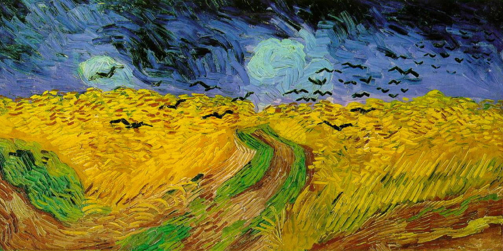

# Gogh

Gogh is a tool to manage GitHub repositories efficiently, inspired by [`ghq`](https://github.com/motemen/ghq).

[](https://pkg.go.dev/github.com/kyoh86/gogh/v4)
[](https://goreportcard.com/report/github.com/kyoh86/gogh/v4)
[](https://codecov.io/gh/kyoh86/gogh)
[](https://github.com/kyoh86/gogh/releases)



## Description

**`gogh` is forked from [`ghq`](https://github.com/motemen/ghq).**

```console
$ gogh list
github.com/kyoh86/git-branches
github.com/kyoh86/gogh
github.com/kyoh86/vim-wipeout
github.com/kyoh86-tryouts/bare
github.com/nvim-telescope/telescope.nvim
...
```

`gogh` provides a way to organize remote repository clones, like `go clone` does.  When you clone a
remote repository by `gogh clone`, `gogh` makes a directory under a specific root directory (by default
`~/go/src`) using the remote repository URL's host and path.  And creating new one by `gogh create`,
`gogh` make both of a local repositories and a remote repository.

```console
$ gogh clone https://github.com/kyoh86/gogh
# Runs `git clone https://github.com/kyoh86/gogh ~/go/src/github.com/kyoh86/gogh`
```

You can also do:

- List repositories (local repositories) (`gogh list`).
- Create a new repository (`gogh create`).
- Fork a repository (`gogh fork`).
- Clone a repository (`gogh clone`).
- Delete a repository (`gogh delete`).
- List remote repositories (`gogh repos`).
- Show the current working directory's repository (`gogh cwd`).
- Manage [overlay files](#overlay-feature) (`gogh overlay`) and [hooks](#hook-feature).

See [#Available commands](#available-commands), [#Overlay Feature](#overlay-feature) and [#Hook Feature](#hook-feature) for more information.

## Install

### For Golang developers

Ensure you have Go installed before running the following commands.

```console
$ go install github.com/kyoh86/gogh/v4/cmd/gogh
```

If you want zsh-completions, you can create completions file like this:

```console
$ echo "autoload -Uz compinit && compinit" >> ~/.zshrc
$ gogh completion zsh > $fpath[1]/_gogh
```

### `Homebrew`/`Linuxbrew`

```console
$ brew tap kyoh86/tap
$ brew update
$ brew install kyoh86/tap/gogh
```

## Setup

`gogh` manages repositories in multiple servers that is pairs of an owner and a host name.
To login in new server or logout, you should use `auth login`.

## Available commands

See [doc/usage/gogh.md](./doc/usage/gogh.md) for detailed command usage.

### Show repositories

| Command | Description                                                               |
| --      | --                                                                        |
| `cwd`   | Print the local repository which the current working directory belongs to |
| `list`  | List local repositories                                                   |
| `repos` | List remote repositories                                                  |

### Manipulate repositories

| Command  | Description                              |
| --       | --                                       |
| `clone`  | Clone remote repositories to local       |
| `create` | Create a new local and remote repository |
| `delete` | Delete local and remote repository       |
| `fork`   | Fork a repository                        |

### Configurations

| Command   | Description                     |
| --        | --                              |
| `auth`    | Manage tokens                   |
| `config`  | Show / Change configurations    |
| `overlay` | Manage repository overlay files |
| `hook`    | Manage hook scripts             |
| `roots`   | Manage roots                    |

### Others

| Command      | Description                                                |
| --           | --                                                         |
| `bundle`     | Manage bundle                                              |
| `completion` | Generate the autocompletion script for the specified shell |
| `help`       | Help about any command                                     |

Use `gogh [command] --help` for more information about a command.
Or see the manual in [doc/usage/gogh.md](./doc/usage/gogh.md).

## Environment variables

- `GOGH_CONFIG_PATH`
    - **(DEPRECATED)** The path to the configuration file.
    - Default: `${XDG_CONFIG_HOME}/gogh/config.yaml`.
- `GOGH_DEBUG`
    - Enable debug mode.
    - Default: ``.
    - Set to `1` to enable debug mode.
- `GOGH_DEFAULT_NAMES_PATH`
    - The path for the default names.
    - Default: `${XDG_CONFIG_HOME}/gogh/default_names.v4.toml`
- `GOGH_FLAG_PATH`
    - The path for values for each `gogh` flags.
    - Default: `${XDG_CONFIG_HOME}/gogh/flags.v4.toml`
- `GOGH_TOKENS_PATH`
    - The path for the tokens.
    - Default: `${XDG_CACHE_HOME}/gogh/tokens.v4.toml`
- `GOGH_OVERLAY_PATH`
    - The path to store overlay files.
    - Default: `${XDG_CONFIG_HOME}/gogh/overlay.v4/`
- `GOGH_HOOK_PATH`
    - The path to store hook scripts.
    - Default: `${XDG_CONFIG_HOME}/gogh/hook.v4/`
- `GOGH_WORKSPACE_PATH`
    - The path for the workspaces.
    - Default: `${XDG_CONFIG_HOME}/gogh/workspace.v4.toml`

## Configurations

### Roots

`gogh` manages repositories under the `roots` directories.

See also: [Directory structures](#directory-structures)

You can change the roots with `roots add <path>` or `roots remove <path>` and see all of them by
`roots list`.  `gogh` uses the primary one to `create`, `fork` or `clone` to put a local repository
under it. If you want to change the primary, use `roots set-primary <path>`.

Default: `${HOME}/Projects`.

### Default Host and Owner

When you specify a repository with ambiguous user or host, it will be interpolated with a default
value. You may set them with `config set-default-host <host>` and `config set-default-owner <host> <owner>`.

If you set them like below:

| key     | value         |
| -       | -             |
| `host`  | `example.com` |
| `owner` | `kyoh86`      |

ambiguous repository names will be interpolated:

| Ambiguous name | Interpolated name       |
| --             | --                      |
| `gogh`         | example.com/kyoh86/gogh |
| `foobar/gogh`  | example.com/foobar/gogh |

NOTE: default host will be "github.com" if you don't set it.

### Flags

You can set flags for each command in the configuration file.  The flags are used to set the default
values for each command.  You can set the flags in the configuration file like this:

```toml
[repos]
    limit = 7
    archive = "not-archived"
[bundle-restore]
    request-timeout = 5
```

The configuration file is located at `${XDG_CONFIG_HOME}/gogh/flags.v4.toml` by default, and you can
change the path with the `GOGH_FLAG_PATH` environment variable.

NOTE: If you set the boolean flags to `true` in the configuration file, you can disable them in the command line by
using `--<flag>=false`. For example, if you set `--private=true` in the configuration file, you can disable it by
using `--private=false` in the command line.

## Directory structures

Local repositories are placed under `gogh.roots` with named `*host*/*user*/*repo*.

```
~/Projects             -- primary root
    +-- github.com/
        |-- google/
        |   +-- go-github/
        |-- kyoh86/
        |   +-- gogh/
        +-- alecthomas/
            +-- kingpin/
/path/to/another/root  -- another root
    +-- github.com/
        |-- kyoh86/
        |   +-- gogh/
        |   +-- git-branches/
        |   +-- vim-wipeout/
        |   +-- bare/
        |   +-- tryouts/
        |-- anybody/
            +-- yyy/
/...
```

## Overlay Feature

### What are Overlays?

Overlays are a powerful feature in Gogh that allow you to automatically place custom files into repositories.
They're particularly useful for:

- Adding untracked files (like editor configurations or scripts)
- Applying consistent settings across multiple repositories
- Creating templates for new projects

### How Overlays Work

When you run commands like `gogh create`, `gogh clone`, or `gogh fork`,
Gogh can automatically copy overlay files into the repository based on your configuration.

### Use Cases

1. **Editor Configuration**: Automatically add your favorite editor settings to each repository
2. **Project Templates**: Apply language-specific configurations to new projects
3. **License Files**: Ensure all your repositories have the correct license file
4. **CI/CD Templates**: Add standard workflow files to all repositories

### Basic Overlay Commands

Example commands to manage overlays:
See each `--help` for more details.

```console
# gogh overlay add <source-path> <repo-pattern> <target-path>
$ gogh overlay add /path/to/source/vscode/settings.json "github.com/owner/repo" .vscode/settings.json
$ gogh overlay list
# gogh overlay remove <repo-pattern> <target-path>
$ gogh overlay remove "github.com/owner/repo" .vscode/settings.json
# gogh overlay apply [repo-refs...]
$ gogh overlay apply "github.com/owner/repo" "github.com/owner/another-repo"
```

### Practical Usages

#### Template Files for New Projects

You can create templates that only apply when initializing a new repository:

```console
$ gogh overlay add --for-init /path/to/source/deno.jsonc "github.com/owner/deno-*" deno.jsonc
```

#### Extracting Untracked Files as Overlays

Extract files from a repository that aren't tracked by git:

```console
$ gogh overlay extract [repo-refs...]
```

#### Repository Pattern Matching

You can use patterns to match repositories:
- Exact match: `github.com/owner/repo`
- Wildcard: `github.com/owner/*`
- Multiple directories: `**/docs`

#### Showing Overlay Content

View the content of registered overlays:

```console
$ gogh overlay show
```

#### Overlays Never Match

Overlays can be applied manually when needed, giving you complete control over your repository setup.
You can use the patterns to not match any repository, effectively disabling the automatic application of overlays:

```console
$ gogh overlay add /path/to/source/never-match.txt "kyoh86.dev/never-match/1" never-match.txt
```

kyoh86.dev is MY domain, so it will never match any repository in Gogh.
You can use your own domain or any other pattern that doesn't match your repositories.

## Hook Feature

### What are Hooks?

Hooks in Gogh are scripts that run automatically at specific points in the repository lifecycle.

They allow you to automate tasks like:

- Running tests after cloning a repository
- Setting up variables in the template files
- etc.

### How Hooks Work

Hooks are defined in the configuration file and can be triggered by various Gogh commands.

- Commands
    - `gogh clone`
    - `gogh create`
    - `gogh fork`
- Events
    - After cloning a repository
    - After overlay files are applied

Commands and events can be combined to create complex workflows.

### Basic Hook Commands

- `gogh hook add`: Register an existing Lua script as a hook
- `gogh hook apply`: Run a hook script manually for a specific repository
- `gogh hook create`: Create a new hook script using your configured editor
- `gogh hook edit`: Modify an existing hook script
- `gogh hook list`: View all registered hooks
- `gogh hook remove`: Delete a registered hook

Example commands to manage hooks:

```console
# gogh hook add [flags] <lua-script-path>
$ gogh hook add --repo-pattern "github.com/owner/*" /path/to/myscript.lua
# gogh hook create [flags]
$ gogh hook create --repo-pattern "github.com/owner/*" --use-case "create" --event "after-clone"
$ gogh hook list
# gogh hook remove <hook-id>
$ gogh hook remove f8be36a27fa682b7b8d3c4117086851c74e47142705eba633cd91715c315d96b
# gogh hook apply <hook-id> [[<host>/]<owner>/]<name>
$ gogh hook apply f8be36a27fa682b7b8d3c4117086851c74e47142705eba633cd91715c315d96b github.com/owner/repo
# gogh hook edit <hook-id>
$ gogh hook edit f8be36a27fa682b7b8d3c4117086851c74e47142705eba633cd91715c315d96b
```

### Hook Configuration

Hooks can be configured with these parameters:

- **Repository Pattern**: Controls which repositories the hook applies to
  - Works like overlay patterns: `github.com/owner/*`, exact matches, etc.
- **Use Case**: When the hook should run automatically
  - `clone`: When cloning a repository
  - `create`: When creating a new repository
  - `fork`: When forking a repository
  - `never`: Only run manually (default)
- **Event**: The specific point in the process to run the hook
  - `after-clone`: After the repository is cloned
  - `after-overlay`: After overlay files are applied

### Writing Lua Hook Scripts

Hooks are run by Gogh with the working directory set to the repository's root directory.
Hooks are written in Lua and have access to variables through the `gogh` global table:

```lua
-- Available variables
gogh.repo.host      -- e.g., "github.com"
gogh.repo.owner     -- e.g., "kyoh86" 
gogh.repo.name      -- e.g., "gogh"
gogh.repo.path      -- Repository path relative to workspace
gogh.repo.full_path -- Full absolute path to the repository

-- Example hook script
print("Setting up repository: " .. gogh.repo.owner .. "/" .. gogh.repo.name)
os.execute("npm install")
```

### Practical Examples

#### Setting Up Dependencies

```lua
-- setup-deps.lua
if os.execute("test -f ./package.json") == 0 then
  print("Installing Node.js dependencies...")
  os.execute("npm install")
elseif os.execute("test -f ./go.mod") == 0 then
  print("Downloading Go dependencies...")
  os.execute("go mod download")
end
```

#### Custom Git Configuration

```lua
-- project-git-config.lua
print("Setting repository-specific Git configuration...")
os.execute("git config user.email 'work@example.com'")
```

# LICENSE

[](http://www.opensource.org/licenses/MIT)

This software is released under the [MIT License](http://www.opensource.org/licenses/MIT), see
LICENSE.  And this software is based on [`ghq`](https://github.com/motemen/ghq).
